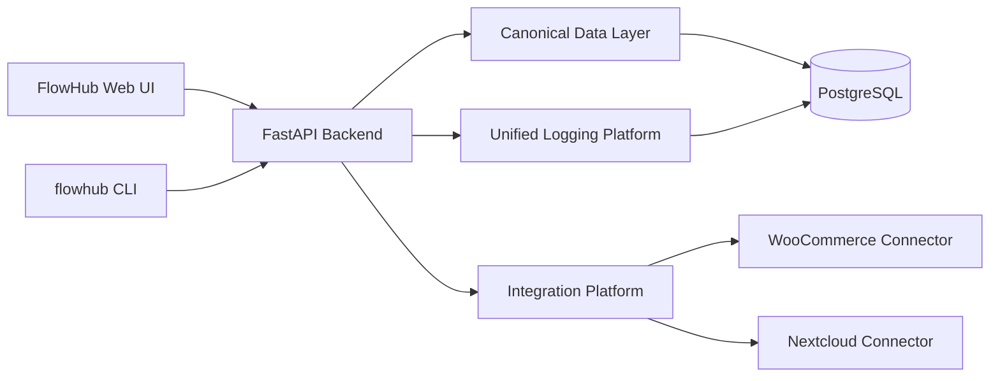
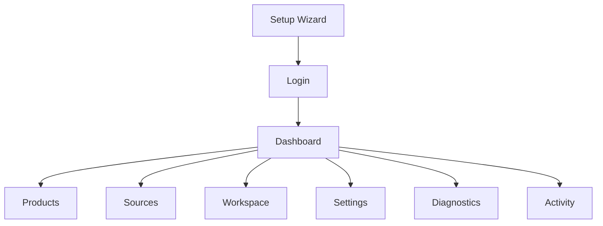

# FlowHub

[](https://github.com/nima-sadria/FlowHub)
[](docker-compose.yml)
[](LICENSE)
[](RELEASE_NOTES.md)

FlowHub is a self-hosted multi-channel commerce operations platform. It centralizes product, source, workspace, diagnostics, activity, and settings views behind a read-only first-release safety model.

The first release is designed for safe deployment: connectors can read and diagnose external systems, but write execution remains disabled until explicitly approved in a future release.

## Architecture





## Features

- Clean first-run setup: Welcome, Server Profile, Database, Admin Account, Finish.
- Connector configuration in one place: Settings.
- Canonical Data Layer for products, sources, workspace state, and snapshots.
- Integration Platform with connector registry, settings, health, diagnostics, telemetry, and webhook contracts.
- Unified Logging Platform with structured logs, search, correlation IDs, redaction, retention, and export contracts.
- Read-only first-release safety: no Apply, no scheduler execution, no automatic pricing, no WooCommerce writes, no spreadsheet writes.
- Professional installer and `flowhub` server management command.

## Quick Start

Install with curl:

```bash
curl -fsSL https://raw.githubusercontent.com/nima-sadria/FlowHub/main/installer/install.sh | sudo bash
```

Install with wget:

```bash
wget -qO- https://raw.githubusercontent.com/nima-sadria/FlowHub/main/installer/install.sh | sudo bash
```

Clone repository:

```bash
git clone https://github.com/nima-sadria/FlowHub.git
cd FlowHub
sudo ./installer/install.sh
```

## Docker Install

```bash
git clone https://github.com/nima-sadria/FlowHub.git
cd FlowHub

cp .env.example .env

docker compose -f docker-compose.yml \
  --env-file .env up -d --build
```

Run migrations after the Docker stack is healthy:

```bash
docker compose -f docker-compose.yml \
  --env-file .env exec app alembic -c alembic_flowhub.ini upgrade head
```

## Installer

The installer supports Ubuntu Server 24.04 LTS and Ubuntu Server 26.04 LTS on
x86_64/amd64 hosts. Ubuntu Core is not supported. Other Debian/Ubuntu hosts are
best-effort only and require explicit confirmation.

FlowHub installs into:

```text
/opt/FlowHub
```

It detects distribution, Ubuntu version, Ubuntu Core, architecture, `apt-get`,
curl/wget, CPU, RAM, disk, Docker, Docker Compose, existing installations, and
Legacy Compatibility installations at `/opt/flowhub`.

Installer actions:

```bash
sudo ./installer/install.sh
sudo ./installer/install.sh --upgrade
sudo ./installer/install.sh --repair
sudo ./installer/install.sh --reinstall
sudo ./installer/install.sh --uninstall
```

If `/opt/FlowHub` already exists, the installer does not overwrite it blindly.
It offers Upgrade, Repair, Reinstall, or Exit. Upgrade and Repair preserve
configuration, generated secrets, database data, uploads, backups, logs, and
Docker volumes. Reinstall warns before destructive actions.

Generated administrator passwords are printed once during installation and are
not stored in plaintext logs or backups.

## Update

```bash
cd /opt/FlowHub
git pull
sudo ./installer/install.sh --upgrade
```

## Uninstall

```bash
sudo ./installer/install.sh --uninstall
```

## CLI

After installation, the `flowhub` command is available:

```bash
flowhub
```

Running `flowhub` without arguments opens the simple operator menu:

```text
FlowHub Management

Maintenance
1. Install
2. Update
3. Uninstall
4. Domain + SSL Setup
5. IP + Port Setup

Account
6. Admin Setup
7. Show Base URL
8. Show Admin Users
9. Add Admin User
10. Delete Admin User

Status
11. Status Overview

Diagnostics
12. Logs
13. Errors & Warnings

0. Exit
```

On installed hosts, menu option 1 is disabled and prints:

```text
FlowHub is already installed. Use Update instead.
```

Advanced recovery and support commands remain available only through direct
command mode:

```bash
flowhub install
flowhub upgrade
flowhub update
flowhub repair
flowhub reinstall
flowhub status
flowhub health
flowhub logs
flowhub start
flowhub restart
flowhub stop
flowhub uninstall
flowhub backup
flowhub restore backups/flowhub-YYYYMMDDTHHMMSSZ.tar.gz
flowhub base-url
flowhub overview
flowhub errors
flowhub domain set kharidbezan.com
flowhub tls status
flowhub tls letsencrypt kharidbezan.com
flowhub admin list
flowhub admin create
flowhub admin delete
flowhub admin reset-username
flowhub admin reset-password
```

The installed `flowhub` wrapper is Docker-backed. Runtime commands use a
root-owned helper with a strict sudoers allowlist, so the normal installing
operator can run FlowHub management commands without manually typing `sudo`.
The wrapper does not read `.env` directly; `.env` remains protected as
`root:root 600`. `flowhub restart` waits for the application health endpoint
before returning successfully.

On an installed host, `flowhub install` does not re-enter the installer workflow;
use Update from the menu or `flowhub upgrade` from direct command mode instead.

### Domain and TLS

Use menu option **4. Domain + SSL Setup** to configure the public domain, panel
port, and recorded TLS mode. It prints the resulting URL as:

```text
https://example.com:PORT/
```

Use menu option **5. IP + Port Setup** for local or private-network deployments
without SSL. It prints:

```text
http://IP:PORT/
```

Direct command mode is still available for support sessions:

```bash
flowhub domain set kharidbezan.com
flowhub tls letsencrypt kharidbezan.com
flowhub tls status
flowhub start
```

FlowHub's current Docker stack exposes the app and expects certificate issuance
and renewal to be handled by an external reverse proxy. FlowHub records the
desired public URL and TLS mode; it does not store Let's Encrypt private keys in
this release.

## Verification

```bash
curl http://localhost:8085/api/health
docker compose -f /opt/FlowHub/docker-compose.yml \
  --env-file /opt/FlowHub/.env ps
flowhub health
```

## Screenshots

Current release UI previews are stored in `docs/assets/screenshots/`.

| Dashboard | Workspace | Settings |
| --- | --- |
|  |  |  |

## Documentation

- [Current Architecture](docs/architecture/CURRENT_ARCHITECTURE.md)
- [Integration Platform](docs/architecture/INTEGRATION_PLATFORM.md)
- [Unified Logging Platform](docs/architecture/UNIFIED_LOGGING_PLATFORM.md)
- [Installer Architecture](docs/platform/INSTALLER_ARCHITECTURE.md)
- [Installation Guide](docs/INSTALLATION.md)
- [Upgrade Guide](docs/UPGRADE.md)
- [Backup and Restore](docs/BACKUP_RESTORE.md)
- [Troubleshooting](docs/TROUBLESHOOTING.md)
- [FAQ](docs/FAQ.md)
- [Release Checklist](docs/RELEASE_CHECKLIST.md)
- [Roadmap](ROADMAP.md)
- [Support](SUPPORT.md)

## Current vs Planned

Current:

- FlowHub web app, installer, CLI, setup wizard, Data Layer, Integration Platform, Unified Logging Platform, Diagnostics, Settings, and read-only connector management.

Planned:

- Additional connectors including Shopify, Magento, ERP, CSV, Google Sheets, and custom APIs.
- Scheduler execution, Apply flows, and write automation only after Owner approval and new safety review.
- Live logging tail and advanced telemetry visualizations.

## Contributing

See [CONTRIBUTING.md](CONTRIBUTING.md), [CODE_OF_CONDUCT.md](CODE_OF_CONDUCT.md), and [SECURITY.md](SECURITY.md).

## License

FlowHub is released under the [MIT License](LICENSE).

## Support

For usage help, deployment issues, and security reporting, see [SUPPORT.md](SUPPORT.md).
