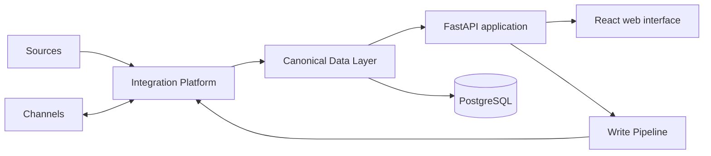

# FlowHub

[](https://github.com/nima-sadria/FlowHub/actions/workflows/flowhub-frontend.yml)
[](docker-compose.yml)
[](LICENSE)

FlowHub is a self-hosted, multi-channel commerce platform for bringing product
data from Sources into a canonical business model and operating external sales
Channels through controlled, auditable workflows.

The backend and frontend package metadata currently report version `1.0.0`.
`main` is the active development line. Older v1.2 and v1.3 release documents
remain in the repository as historical records; they are not the current
product description.

## Product model

- **Sources** provide data to FlowHub. Current workflows cover Nextcloud
  spreadsheets, managed FlowHub Sheets, and CSV/XLSX imports.
- **Channels** are external sales destinations. Implemented connector paths
  include WooCommerce, SnappShop, and TapsiShop; capabilities vary by provider.
- The **Data Layer** is FlowHub's canonical business-data model for products,
  listings, source snapshots, workspace state, connector health, and related
  operational records.
- The **Integration Platform** owns communication with external systems,
  including connector configuration, health, capabilities, telemetry, polling,
  and webhooks.
- The **Write Pipeline** is the protected external-write authority. A write is
  never an automatic side effect of reading or editing data.



Every supported write follows the same safety sequence:


Source writes, automatic pricing, and automatic Apply are disabled. Product
writes are capability- and permission-gated, recorded before provider I/O, and
must produce verification or an explicit reconciliation-required outcome.

## Current product surface

| Area | Current behavior |
| --- | --- |
| Dashboard | Seller-focused operational summary backed by current FlowHub records. |
| Products | Browses canonical/channel product data and supports protected channel-price workflows. |
| Orders | Lists normalized marketplace orders and exposes controlled synchronization status/actions. |
| Sources | Source Center, Source Configuration, spreadsheet import, FlowHub Sheet, mapping revisions, and lifecycle controls. |
| Commerce Hub | Configures Sources and Channels, credentials, capabilities, cache refreshes, connection checks, and health. |
| Workspace | Source and manual workspaces, immutable snapshots/drafts, review, selection, Apply, verification, and reconciliation. |
| Data Quality | Scans source mappings and data for blocking issues and actionable warnings. |
| Activity | Searches and filters the operational audit trail. |
| Diagnostics | Shows system, connector, synchronization, webhook, and worker evidence without exposing secrets. |
| Rate Limits | Displays and manages supported global API rate-limit settings. |
| Settings | General configuration, locale, connector-related settings, rate limits, and User Management. |

Authentication uses short-lived access tokens and rotating refresh tokens.
User-initiated logout revokes the backend refresh token on a best-effort basis
and always clears local authentication state. User Management provides
role-based account creation, role/status changes, password reset, and deletion
with owner and privileged-account protections.

The React interface includes persistent light and dark themes. English is the
fallback language; the complete Persian catalog enables RTL layout, Persian
typography, and locale-aware formatting from Settings.

## Setup Wizard

On a fresh database, FlowHub redirects to `/setup`. The wizard collects:

1. Server profile: domain, timezone, and currency.
2. Database readiness and migration verification.
3. Initial owner username, email, and password.
4. Final confirmation, after which setup is locked.

Connector credentials are configured after sign-in through Settings and
Commerce Hub. The installer does not create the owner account.

## Production installation

The supported installer target is Ubuntu Server 24.04 or 26.04 LTS on
amd64/x86_64. Ubuntu Core is not supported. Other Debian/Ubuntu hosts require
explicit best-effort confirmation.

One-line installation:

```bash
curl -fsSL https://raw.githubusercontent.com/nima-sadria/FlowHub/main/installer/install.sh | sudo bash
```

Or install from a clone:

```bash
git clone https://github.com/nima-sadria/FlowHub.git
cd FlowHub
sudo ./installer/install.sh
```

The installer uses `/opt/FlowHub`, creates the environment and generated
secrets, builds the Compose stack, runs database migrations, installs the
Docker-backed `flowhub` management command, starts services, and verifies
`/api/health`. It then directs the operator to the Setup Wizard.

See the [Installation Guide](docs/INSTALLATION.md) for prerequisites, existing
installation handling, trusted proxies, the management CLI, and external
reverse-proxy/TLS guidance.

### Manual Docker Compose

Review every value in `.env` before starting the stack:

```bash
git clone https://github.com/nima-sadria/FlowHub.git
cd FlowHub
cp .env.example .env
docker compose --env-file .env -f docker-compose.yml config
docker compose --env-file .env -f docker-compose.yml up -d --build
docker compose --env-file .env -f docker-compose.yml \
  exec app alembic -c alembic_flowhub.ini upgrade head
```

The default production runtime contains:

- `app`: FastAPI plus the built React application, container port `8085`.
- `order-sync-runner`: the separate marketplace order synchronization worker.
- `postgres`: PostgreSQL 16 with an internal-only database port.

Compose also defines a `frontend` build-stage service under the optional
`build` profile; it is not a separate production web server.

The host binding defaults to `0.0.0.0:8085` and is controlled by
`FLOWHUB_BIND_IP` and `FLOWHUB_PORT`. TLS termination is not included in the
Compose stack; use an external reverse proxy for public HTTPS.

## Configuration

[`.env.example`](.env.example) is the canonical environment template. It covers:

- deployment profile, domain, host port, and recorded TLS mode;
- PostgreSQL URL/database/user/password;
- JWT and internal API secrets;
- trusted proxy networks;
- timezone, currency, storage, backup, logging, and upload limits;
- optional Nextcloud and WooCommerce bootstrap credentials;
- order synchronization and SnappShop synchronization limits.

Connector credentials can be absent at startup and configured later in the UI.
Never commit `.env` or expose its secrets in logs, screenshots, or support
output. Production Handsontable grids require a valid
`VITE_HANDSONTABLE_LICENSE_KEY`; no license key is committed.

## Local development

Use Python 3.12 or newer and Node.js 20. For source-level tests and frontend
development:

```bash
git clone https://github.com/nima-sadria/FlowHub.git
cd FlowHub
python -m pip install -r requirements-test.txt

cd frontend
npm ci
npm run dev
```

The Vite development server listens on `5173` and proxies API/static requests to
`localhost:8000`. With a development database and environment configured, start
the backend from the repository root with:

```bash
uvicorn app.flowhub.app:app --reload --port 8000
```

For an integrated local runtime, use the Docker Compose procedure above.

## Upgrade

```bash
cd /opt/FlowHub
git pull
sudo ./installer/install.sh --upgrade
```

Upgrade preserves `.env`, generated secrets, database data, uploads, logs,
backups, and Docker volumes while rebuilding images, running migrations,
restarting services, and checking health. Read the [Upgrade
Guide](docs/UPGRADE.md) and create a backup before major upgrades.

## Health checks

Replace `8085` if `FLOWHUB_PORT` is customized:

```bash
curl -fsS http://localhost:8085/api/health
flowhub health
docker compose -f /opt/FlowHub/docker-compose.yml \
  --env-file /opt/FlowHub/.env ps
```

The public health endpoint is `GET /api/health`. Authenticated operational
detail is available through Diagnostics and the v2 diagnostics/health APIs.

## Uninstall

On an installer-managed host:

```bash
flowhub uninstall
```

The direct installer action is also available from `/opt/FlowHub`:

```bash
sudo ./installer/install.sh --uninstall
```

Uninstall is destructive and requires confirmation. Review backup and data
retention needs first.

## Testing

Backend checks run from the repository root; frontend checks run from
`frontend/`:

```bash
python -m pytest -q

cd frontend
npm ci
npm run i18n:validate
npm run build
npm test
```

PostgreSQL integration/concurrency tests use the isolated stack and commands in
[Order Synchronization](docs/architecture/ORDER_SYNCHRONIZATION.md).

## Repository layout

| Path | Purpose |
| --- | --- |
| `app/flowhub/` | Active FastAPI application and product/domain services. |
| `frontend/` | React, TypeScript, Vite, Vitest, localization runtime, and UI. |
| `alembic_flowhub/` | Active FlowHub database migrations. |
| `installer/` | Supported server installer and lifecycle actions. |
| `scripts/` | Installed Docker-backed management wrapper and helper. |
| `cli/` | Source-level configuration, diagnostics, integration, and admin CLI modules. |
| `tests/` | Backend, migration, integration, safety, and compatibility tests. |
| `locales/` | Gettext templates and translator catalogs. |
| `docs/` | Architecture, operations, API, security, and historical release documents. |

The production entry point is `app.flowhub.app:app`. Legacy compatibility
modules and historical phase documents are not the current architecture.

## Documentation

- [Integration Platform](docs/architecture/INTEGRATION_PLATFORM.md)
- [Unified Multi-Channel Workspace](docs/architecture/UNIFIED_MULTI_CHANNEL_WORKSPACE.md)
- [Order Synchronization](docs/architecture/ORDER_SYNCHRONIZATION.md)
- [Source Workspace API](docs/api/SOURCE_WORKSPACE_API.md)
- [Unified Workspace API](docs/api/UNIFIED_WORKSPACE_API.md)
- [Internationalization](docs/i18n/INTERNATIONALIZATION.md)
- [Installation](docs/INSTALLATION.md)
- [Upgrade](docs/UPGRADE.md)
- [Backup and Restore](docs/BACKUP_RESTORE.md)
- [Troubleshooting](docs/TROUBLESHOOTING.md)
- [Security](SECURITY.md)
- [Contributing](CONTRIBUTING.md)
- [Support](SUPPORT.md)

## License

FlowHub is released under the [MIT License](LICENSE).
