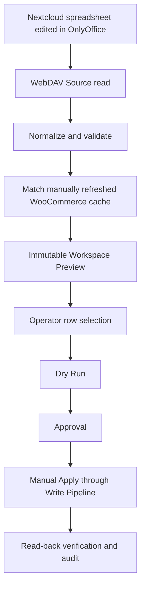

# FlowHub 1.0.0 Price Workflow

## Source and Channel responsibilities

A **Source** is read-only input. In 1.0.0 the supported production Source is a
Nextcloud spreadsheet: OnlyOffice edits the file, Nextcloud stores it, and
FlowHub reads it through authenticated WebDAV. CSV and Google Sheets are not
implemented in this release.

A **Channel** is the external commerce target. The supported production Channel
is WooCommerce. An operator manually refreshes its read-only product cache before
creating a Workspace Preview. The cache includes simple products, variable
parents, and variations.

## Approved flow

Preview snapshots are owned by the initiating user, expire, include hashes, and
are the only authoritative source for Dry Run item creation. The browser sends
only a preview ID and selected row IDs. Rows with blocking errors, unchanged
prices, and stock-only changes cannot be selected.

## Safety model

- No Apply without a successful Dry Run and separate Approval.
- The Write Pipeline is the only WooCommerce write path.
- Only simple-product and variation **price** fields are written.
- Stock is shown read-only in Preview; FlowHub never writes stock.
- Sources are never written back to.
- Pricing has no scheduler, automatic synchronization, or automatic Apply.
  Marketplace order synchronization is handled separately by
  `order-sync-runner` and does not write product prices.
- Maintenance mode blocks Dry Run, Approval, and Apply, except for the audited
  owner/super-admin policy where configured.
- A failed or partial cache refresh blocks Preview. A warning-complete refresh is
  visible to the operator before Preview proceeds.
