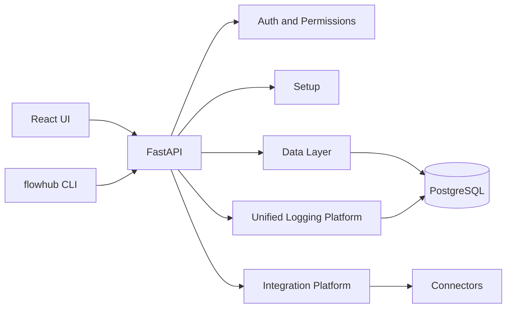

# Current Architecture

Status: current first-release implementation.

FlowHub is a self-hosted FastAPI and React application deployed with Docker
Compose. PostgreSQL is the canonical persistence layer. The Data Layer is the
canonical product/source/workspace data architecture; cache is an internal
implementation mechanism only.

## Runtime Shape



The active first-release backend entrypoint is `app.flowhub.app`. Legacy
`app/main.py` and `app/services/*` modules are retained only for historical
compatibility and are not imported by the active FlowHub Docker runtime.

## Setup Wizard

Current setup steps:

1. Welcome
2. Server Profile
3. Database
4. Owner Account
5. Finish

The Owner Account step collects username, email, and password. Email is
validated in the UI and again by `POST /api/v2/setup/admin`.

Connector configuration is not part of setup. Source and Channel configuration
is handled after sign-in through Settings and Commerce Hub surfaces.

Startup does not require WooCommerce or Nextcloud credentials. Connector
credentials may be absent until an administrator configures them after sign-in.

Setup API:

- `GET /api/v2/setup/status`
- `POST /api/v2/setup/server-profile`
- `POST /api/v2/setup/database`
- `POST /api/v2/setup/admin`
- `POST /api/v2/setup/complete`

## Data Layer

The Data Layer owns the canonical operational records used by Products, Sources,
Workspace, Diagnostics, and related status views. Integration Platform services
populate Data Layer records where connector data is approved for read-only use.

## Integration Platform

Current:

- Connector registry
- Connector instances
- Connector settings
- Secret masking
- Health snapshots
- Diagnostics
- Telemetry
- Capability metadata
- Webhook verification contract
- Read-only write guard

Capabilities describe what a connector can do. Capabilities do not grant
authorization. Runtime authorization and write blocking remain separate.

## Commerce Hub

Commerce Hub is the product-facing organization layer for commerce data in
FlowHub 1.0.0.

Terminology:

- Sources are input systems that feed FlowHub / Data Layer.
- Channels are commerce systems whose catalog state is read into FlowHub.
- Channels are implemented internally by the connector framework under
  `app/connectors/destinations/`, but the product UI uses the term Channel.

Current Sources shown in Commerce Hub:

- Nextcloud
- CSV
- Google Sheets
- ERP / API Import

Current Channels shown in Commerce Hub:

- WooCommerce: first implemented Channel.
- Snapp Shop: planned read-only Channel placeholder.
- Tapsi Shop: planned read-only Channel placeholder.
- Digikala, Technolife, Shopify: future Channel placeholders.

Commerce Hub relationship map:

```text
Source
  |
  v
FlowHub / Data Layer
  |
  v
Channel
```

Example:

```text
Nextcloud
  |
  v
Data Layer
  |
  v
WooCommerce
```

Commerce Hub does not enable marketplace writes, Apply execution, Scheduler
execution, or automatic pricing.

## Unified Logging Platform

Current:

- Structured application log entries
- Correlation and request IDs
- Frontend log ingestion
- Protected backend ingestion behavior
- Redaction of secret-like values
- Search, summary, export, retention, and policy APIs

## Safety Model

Disabled in the first release:

- Apply execution
- Scheduler execution
- Automatic pricing
- WooCommerce writes
- Spreadsheet writes

Connector communication for WooCommerce and Nextcloud is isolated to connector
and integration layers. Active FLOWHUB v2 API routes must not directly call external
WooCommerce, WebDAV, OCS, `httpx`, or `requests` clients.

`FEATURE_SCHEDULER` defaults to disabled. Scheduler files may exist as inactive
unavailables, but the scheduler router is not mounted by `app.flowhub.app` and no
background scheduler execution is started.

## CLI

The installed `flowhub` wrapper is Docker-backed for runtime operations:

- `flowhub` interactive management menu
- `flowhub start`
- `flowhub stop`
- `flowhub restart`
- `flowhub status`
- `flowhub health`
- `flowhub logs`
- `flowhub upgrade`
- `flowhub update` (alias for upgrade)
- `flowhub uninstall`
- `flowhub admin list`
- `flowhub admin create`
- `flowhub admin reset-username`
- `flowhub admin reset-password`

Host-side Python package dependencies are not required for normal runtime CLI
commands.

## Deployment

Canonical installation path:

```text
/opt/FlowHub
```

Legacy Compatibility: older installations at `/opt/flowhub` are migrated by the
installer to `/opt/FlowHub`.

## Planned

- Additional connectors: Shopify, Magento, ERP, CSV, Google Sheets, custom APIs.
- Live logging tail.
- Scheduler execution only after separate approval.
- Write execution only after separate architecture, audit, and Owner approval.
