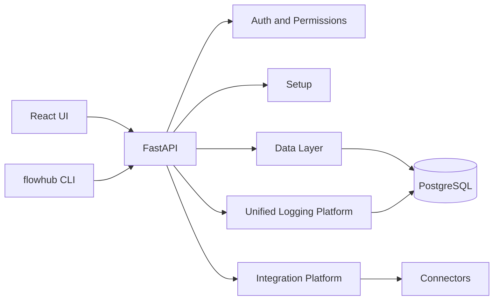

# Current Architecture

Status: current FlowHub v1.2 Stable implementation; architecture frozen.

The approved stable release is registered in
[`docs/releases/FLOWHUB_V1.2_STABLE.md`](../releases/FLOWHUB_V1.2_STABLE.md).
Normal feature work must preserve the approved v1.2 invariants. Architectural
changes require explicit Owner approval.

FlowHub is a self-hosted FastAPI and React application deployed with Docker
Compose. PostgreSQL is the canonical persistence layer. The Data Layer is the
canonical product/source/workspace data architecture; cache is an internal
implementation mechanism only.

## Runtime Shape


```mermaid
flowchart LR
    UI[React UI] --> API[FastAPI]
    CLI[flowhub CLI] --> API
    API --> AUTH[Auth and Permissions]
    API --> SETUP[Setup]
    API --> DL[Data Layer]
    API --> IP[Integration Platform]
    API --> LOG[Unified Logging Platform]
    IP --> CONN[Connectors]
    DL --> DB[(PostgreSQL)]
    LOG --> DB
```

The active first-release backend entrypoint is `app.flowhub.app`. Legacy
`app/main.py` and `app/services/*` modules are retained only for historical
compatibility and are not imported by the active FlowHub Docker runtime.

## Setup Wizard

Current setup steps:

1. Welcome
2. Server Profile
3. Database
4. Owner Account
5. Finish

The Owner Account step collects username, email, and password. Email is
validated in the UI and again by `POST /api/v2/setup/admin`.

Connector configuration is not part of setup. Source and Channel configuration
is handled after sign-in through Settings and Commerce Hub surfaces.

Startup does not require WooCommerce or Nextcloud credentials. Connector
credentials may be absent until an administrator configures them after sign-in.

Setup API:

- `GET /api/v2/setup/status`
- `POST /api/v2/setup/server-profile`
- `POST /api/v2/setup/database`
- `POST /api/v2/setup/admin`
- `POST /api/v2/setup/complete`

## Data Layer

The Data Layer owns the canonical operational records used by Products, Sources,
Workspace, Diagnostics, and related status views. Integration Platform services
populate Data Layer records where connector data is approved for read-only use.

## Integration Platform

Current:

- Connector registry
- Connector instances
- Connector settings
- Secret masking
- Health snapshots
- Diagnostics
- Telemetry
- Capability metadata
- Webhook verification contract
- Read-only write guard

Capabilities describe what a connector can do. Capabilities do not grant
authorization. Runtime authorization and write blocking remain separate.

## Health And Diagnostics

`GET /api/v2/diagnostics/status` includes a unified `channelHealth` payload used
by both Dashboard and Diagnostics. The channel-health read path is local and
record-backed: it summarizes connector configuration, the latest credential and
external API probe snapshot, read/write capabilities, recent product and order
sync evidence, polling cursor progress, webhook receipt/processing state,
dead-letter counts, and token-refresh state.

Explicit provider probes are separate and administrator-only:

- `GET /api/v2/diagnostics/channels/health`
- `POST /api/v2/diagnostics/channels/health/refresh`

Normal health reads do not perform product writes, full product syncs, or full
order syncs. Explicit refresh uses bounded lightweight channel checks and caches
the result briefly in `dl_connector_health`; concurrent refreshes for the same
channel are suppressed. Responses expose sanitized status, latency, last
successful operation, error category, capabilities, and recommended action.
They must not expose tokens, webhook tokens, authorization headers, full
upstream payloads, stack traces, or customer data.

Channel health levels are:

- `Operational`
- `Warning`
- `Error`
- `Unable to check`
- `Disabled`

A disabled channel is reported as `Disabled`, not `Error`. Timeouts are reported
as `Unable to check` unless other durable evidence raises a stronger warning or
error. Missing optional order, pricing, or webhook tables are treated as
unavailable local evidence rather than an API failure, so diagnostics remain
usable during partial migrations.

## Commerce Hub

Commerce Hub is the product-facing organization layer for commerce data in
FlowHub 1.0.0.

Terminology:

- Sources are input systems that feed FlowHub / Data Layer.
- Channels are commerce systems whose catalog state is read into FlowHub.
- Channels are implemented internally by the connector framework under
  `app/connectors/destinations/`, but the product UI uses the term Channel.

Current Sources shown in Commerce Hub:

- Nextcloud
- CSV / Excel file import

Planned Source placeholders shown in Commerce Hub:

- Google Sheets
- ERP / API Import

Current Channels shown in Commerce Hub:

- WooCommerce: first implemented Channel.
- Snapp Shop: implemented marketplace Channel with product, price/stock update,
  order polling, and reconciliation support through protected backend APIs.
- Tapsi Shop: implemented marketplace Channel with product, price/stock update,
  webhook ingestion, order receipt processing, and reconciliation support
  through protected backend APIs.
- Technolife: implemented marketplace Channel with catalog, price/stock update,
  cache refresh, and reconciliation support through protected backend APIs.
- Digikala: `IMPLEMENTED_UNVERIFIED` read-side Channel with write-only bearer
  credential configuration, documented token rotation, and a real read-only
  `GET /orders` connection probe. The supplied contract lacks the
  endpoint-specific field and query schemas needed to normalize product or
  order data into FlowHub caches, so it has no product-cache refresh, order
  synchronization, or order mutation capability. It has not yet been verified
  with Owner credentials.
- Shopify: future Channel placeholder.

Commerce Hub relationship map:

```text
Source
  |
  v
FlowHub / Data Layer
  |
  v
Channel
```

Example:

```text
Nextcloud
  |
  v
Data Layer
  |
  v
WooCommerce
```

Commerce Hub provides Source and Channel configuration and health surfaces. The
protected Write Pipeline is the single external catalog-write authority for the
current Channel connectors. It resolves WooCommerce, SnappShop, TapsiShop, and
Technolife through `WorkspaceConnectorFactory`, performs no-write Dry Run,
requires explicit Approval, and owns Apply and verification. Commerce Hub
itself does not write to Sources, does not write stock, and does not perform
Apply. Digikala is intentionally not resolved by that gateway: all of its
provider-documented write groups are `DOCUMENTED_NOT_IMPLEMENTED`, so no
Digikala operation can enter the Write Pipeline.

## Unified Logging Platform

Current:

- Structured application log entries
- Correlation and request IDs
- Frontend log ingestion
- Protected backend ingestion behavior
- Redaction of secret-like values
- Search, summary, export, retention, and policy APIs

## Safety Model

Deferred in the first release:

- Stock writes
- Source or spreadsheet writes
- Automatic pricing and automatic Apply
- Additional marketplace write channels beyond WooCommerce, SnappShop,
  TapsiShop, and Technolife
- Digikala product/order normalization, cache synchronization, and every
  documented Digikala write group, pending endpoint schemas and a separate
  Owner decision

Connector communication for WooCommerce and Nextcloud is isolated to connector
and integration layers. Active FLOWHUB v2 API routes must not directly call external
WooCommerce, WebDAV, OCS, `httpx`, or `requests` clients.

The A2 deferred write scheduler remains inactive in the FlowHub API runtime.
Marketplace order synchronization uses a separate `order-sync-runner` process
with channel-scoped database leases. It polls SnappShop order events, processes
accepted TapsiShop webhook receipts, and reconciles recent orders without
performing product price writes, stock writes, or automatic Apply.
Digikala is deliberately excluded: its supplied documentation does not define
the order fields or date/status filter contract required for normalized,
idempotent synchronization, and no order mutation is authorized.

## CLI

The installed `flowhub` wrapper is Docker-backed for runtime operations:

- `flowhub` interactive management menu
- `flowhub start`
- `flowhub stop`
- `flowhub restart`
- `flowhub status`
- `flowhub health`
- `flowhub logs`
- `flowhub upgrade`
- `flowhub update` (alias for upgrade)
- `flowhub uninstall`
- `flowhub admin list`
- `flowhub admin create`
- `flowhub admin reset-username`
- `flowhub admin reset-password`

Host-side Python package dependencies are not required for normal runtime CLI
commands.

## Deployment

Canonical installation path:

```text
/opt/FlowHub
```

Legacy Compatibility: older installations at `/opt/flowhub` are migrated by the
installer to `/opt/FlowHub`.

## Planned

- Planned diagram providers: Google Sheets and ERP/API Sources; Shopify
  Channel. Digikala remains `IMPLEMENTED_UNVERIFIED` until an Owner credential
  succeeds on the read-only connection probe and the resulting evidence is
  reviewed by the Owner and Diagram Keeper. Any other provider requires a
  separate Owner decision.
- Live logging tail.
- Scheduler execution only after separate approval.
- Additional write channels only after separate architecture, audit, and Owner approval.
