# FlowHub Source Acquisition and Observation Design

**Status:** Accepted baseline, implementation pending
**Decision:** `ADR-SOURCE-001`
**Last updated:** 2026-08-05

## Purpose

This specification defines the implementation-facing design for Source
configuration, provider capture, immutable Observations, schema safety,
Diagnostics, Workspace provenance, retention, and Source UI.

The stable decision is recorded in `ADR_SOURCE_ARCHITECTURE_V2.md`. This document
may evolve during implementation while every ADR Core Invariant remains true.

## Scope

In scope:

- external Sources such as Nextcloud workbooks and future provider APIs
- uploaded spreadsheet Sources
- managed FlowHub Sheets when the Observation contract is useful
- independent Source Connector Instances
- Config, Execution Policy, and Resource Binding revisions
- Source Runs, immutable Source Observations, and schema assessments
- Source Diagnostics, security, telemetry, retention, and notifications
- explicit Workspace binding to Source and destination observations
- Source Configuration information architecture

Out of scope:

- automatic pricing or automatic Apply
- writing to external Source files
- generic reversal of completed Channel writes
- Channel Diagnostic internals, which remain governed by
  `INTEGRATION_PLATFORM.md` and `MARKETPLACE_CHANNELS.md`
- a mandatory message broker or separate acquisition microservice
- full spreadsheet editing or Excel feature parity

## Architecture Overview

```mermaid
flowchart LR
    UI["Source UI and API"] --> APP["Source Application Service"]
    APP --> PLAN["Stage Registry and Plan Builder"]
    PLAN --> ADAPTER["Source Provider Adapter"]
    ADAPTER --> EXTERNAL["External or Managed Source"]
    PLAN --> RUN["Source Run"]
    RUN --> CAPTURE["Complete Provider Capture"]
    CAPTURE --> OBS["Immutable Source Observation"]
    OBS --> ASSESS["Source Schema Assessment"]
    ASSESS --> MAP["Mapping Engine"]
    MAP --> NORM["Normalization Engine"]
    NORM --> VALIDATE["Validation Engine"]
    VALIDATE --> WORKSPACE["Immutable Workspace Snapshot"]
    WORKSPACE --> PIPELINE["Review, Dry Run, Approval, Apply"]
```



Capture records provider reality. Schema Assessment judges compatibility between
an immutable Observation and an immutable Mapping. Drift never erases reality
and never converts a successful provider capture into an acquisition failure.

Business engines request Observations and normalized state. They never issue
provider calls and never know whether an adapter used one request, batches,
conditional retrieval, a native grid, an uploaded file, or a cached artifact.

## Provider Model

Transport, captured format, and change detection are independent dimensions:

```text
transport:        webdav | upload | google_api | managed
artifact_format:  xlsx | xlsm | csv | native_grid | managed_grid
change_detection: etag | provider_token | content_hash_only | push
```

Each adapter declares capabilities:

```text
supports_conditional_capture
supports_stable_object_id
supports_byte_artifact
supports_stable_column_id
supports_change_notification
supports_ordered_change_token
auth_model
endpoint_policy_kind
```

The provider owns transport behavior. Format parsers and canonical grid
normalization are reusable components and are not embedded in WebDAV logic.

### Provider Change Token

Provider-specific ETags, versions, and revision identifiers are stored as an
opaque `provider_change_token` plus:

```text
change_token_kind: opaque_equality | monotonic
```

For `opaque_equality`, only same or different is meaningful. For `monotonic`,
the adapter implements a versioned comparator returning:

```text
same | forward | regressed | unknown
```

A regressed token is recorded as a warning, forces a capture, and may indicate
provider restore or history rollback. Generic domain code never parses a
provider token directly. The adapter records its comparator ID and version with
the comparison result so a historical Run remains reproducible after adapter
upgrades.

### Endpoint Policy Kind

Adapters declare one endpoint policy:

- `user_target`: operator supplies a host; full SSRF policy applies
- `deployment_target`: deployment admin supplies or allow-lists the host
- `fixed_provider`: adapter code owns a fixed destination allow-list
- `no_network`: no outbound endpoint exists

Source-level UI cannot modify deployment or fixed-provider allow-lists.

## Domain Model

### Source Profile

The stable lifecycle identity for one Source. It references a Connector Instance
and a current logical Resource Binding.

Readiness dimensions:

- connection
- Resource Binding
- acquisition
- schema compatibility
- Mapping
- validation
- operational health

Aggregate states:

| State | Meaning |
| --- | --- |
| `draft` | Required configuration or binding is incomplete. |
| `ready` | Current binding has a usable Observation and compatible Mapping. |
| `degraded` | A current Observation exists, but health, freshness, or schema compatibility requires attention. |
| `disabled` | Explicitly disabled by an authorized operator. |
| `unsupported` | Provider code, media type, parser, provider version, or required capability is unsupported by this build. |

`unsupported` is not used for authentication failure, incomplete settings,
provider outage, disabled state, or stale data.

Schema drift and canonical-header ambiguity set schema compatibility to blocked
and aggregate readiness to `degraded`, even when the latest acquisition Run is
`succeeded`.

### Source Connector Instance

The Integration Platform owner of provider type, enabled state, settings,
write-only secrets, capabilities, health, and rate-limit policy.

Independent Sources use independent Connector Instances unless sharing is
explicitly configured. Shared instances still have separate logical Resource
Bindings, Source authorization, health context, and read budgets.

### Connection Config Revision

An immutable revision of normalized non-secret settings plus secret references.
Secret values remain in the canonical write-only secret mechanism.

The UI supports:

- Save draft
- Test unsaved values
- Save and verify

Failed verification preserves the draft but prevents Ready state.

For Nextcloud:

- credentials are labeled `App password / token`
- browser file-app URLs, public-share URLs, query strings, and URL userinfo are
  rejected
- supported root or personal WebDAV URLs are normalized by the adapter

Automatic secret rotation or OAuth token refresh does not create a Config
Revision. Rotating secret material remains behind the same secret reference and
is recorded in secret audit metadata.

### Execution Policy Snapshot

Every Run persists the exact non-secret execution policy used by its stages:

- policy schema version and policy ID
- connection, response, and total timeouts
- redirect policy
- byte, cell, row, worksheet, formula, and parse-step limits
- retry and backoff policy
- provider rate-limit budget
- endpoint policy classification and allow-list revision
- stage-plan version

The Run stores a sanitized immutable snapshot plus a policy hash. Sensitive
resolved network details are protected by diagnose-level authorization. This
record makes historical timeout, limit, redirect, and retry outcomes explainable.

### Logical Resource Binding

A Resource Binding identifies the logical input selected for a Source. Revisions
record changes without changing the logical binding identity unless the operator
explicitly repoints the Source.

It stores:

- logical binding UUID and lineage
- stable provider object identity when available
- canonical locator or provider resource reference
- display metadata and artifact format
- provider namespace, account, drive, or share identity when applicable
- worksheet selection and header-row policy
- parser options and capture constraints

#### Upload Binding

Creating an Upload Source creates one logical Binding UUID. `Replace content`
captures a new artifact for the same Binding. It does not force Mapping review
when the schema contract still matches.

`Use as a different source` or explicit repoint creates a new logical Binding,
clears current acquisition readiness, and requires Mapping review. File name is
display metadata, not identity.

#### Repointing

Changing logical binding:

1. preserves old Observations as history
2. clears current-binding acquisition readiness
3. prevents old Observations from appearing as current
4. requires acquisition for the new binding
5. requires schema assessment against the current Mapping

### Mapping Revision and Expected Schema Contract

Every immutable Mapping revision records the Source Observation and worksheet
schema against which the operator reviewed it.

For each participating worksheet it stores:

- worksheet identity or managed-Sheet stable identity
- selected header row
- `expected_header_hash`
- `header_fingerprint_algorithm`
- ordered raw headers or a protected schema summary for safe diff display
- Mapping reference modes and targets

The algorithm ID is read from the Mapping revision when comparing. The current
system default is never substituted. Persisted algorithm versions remain
available while referenced; retiring one requires an explicit migration and
operator-safe review plan.

### Header Canonicalization v1

`header-canonical-v1` creates a comparison key while preserving the exact raw
header for display and audit.

The comparison pipeline is fixed and versioned:

1. Apply Unicode NFC, not global NFKC.
2. Map Arabic Presentation Forms-A and Forms-B to base characters using an
   explicit table generated from a pinned Unicode data version and checked into
   FlowHub. Runtime Unicode-library upgrades cannot change this table silently.
3. Map Arabic Yeh `U+064A` to Persian Yeh `U+06CC` and Arabic Kaf `U+0643` to
   Persian Keheh `U+06A9` through the same checked-in versioned table.
4. Remove bidi presentation controls including `U+200E`, `U+200F`, embeddings,
   overrides, and isolates. Preserve all removed characters in raw display data.
5. Convert Unicode separator whitespace to `U+0020`, then remove comparison
   whitespace and ZWNJ `U+200C`. This makes ordinary spacing and Persian
   half-space differences non-semantic for header comparison.
6. Preserve case, digits, punctuation, and every character not covered above.

Raw header text is never rewritten. Schema diff shows the original strings and
may explain which canonicalization rule made them equivalent.

If two non-empty raw headers produce the same canonical key, the worksheet is
`ambiguous` with reason `duplicate_header`. FlowHub never merges them and never
selects one implicitly.

The worksheet header fingerprint includes:

- algorithm ID
- header-row index
- ordered canonical keys
- column count

### Source Schema Assessment

Schema compatibility is a derived immutable relationship, not mutable state on
a Mapping Revision or Source Observation.

Identity:

```text
(
  worksheet_observation_id,
  mapping_revision_id,
  assessment_algorithm_version
)
```

Fields include expected and actual fingerprints, fingerprint algorithm ID,
assessment algorithm version, status, reason codes, evaluated time, and safe
schema-diff metadata.

Statuses:

```text
match | drift | ambiguous | no_mapping
```

Assessment is lazy across history:

- after a successful current-binding acquisition, evaluate only the current
  Mapping so readiness and notification cannot stall silently
- evaluate historical Mapping/Observation pairs only when Preview, Diagnostics,
  or an operator requests them
- cache the immutable result
- a new assessment algorithm creates a new row and never rewrites old rows

`drift` and `ambiguous` block normal Preview, Workspace creation, and Apply.
The operator updates or explicitly reconfirms Mapping, creating a new Mapping
Revision and therefore a new Assessment pair.

### Source Run

Every probe, inspection, capture, or deep Diagnostic attempt has a durable Run.

```text
status: queued | running | succeeded | failed | cancelled | abandoned
result: observed | not_modified | content_unchanged_reparse | none
```

`abandoned` means a lease expired or a worker disappeared without a normal
terminal result. It is distinct from provider or parse failure.

A Run records:

- Source, Connector, Config Revision, and logical Binding identities
- semantic Resource identity hash
- operation and trigger
- status and result
- idempotency key, intent hash, correlation ID, and lease
- immutable Execution Policy Snapshot and hash
- stage outcomes and terminal reason
- start, finish, and duration
- requests, batches, bytes, retries, waits, and provider latency
- capture, normalize, Mapping, validation, and assessment duration
- resulting Observation ID when applicable

#### Idempotency

Idempotency identifies repeated caller intent and is not the concurrency lease.

| Trigger | Idempotency identity |
| --- | --- |
| Manual API | Caller UUID unique within Source and operation. |
| Scheduled | Schedule policy ID plus scheduled UTC slot. |
| Webhook | Connector Instance plus provider event ID. |
| System | Stable command or correlation identity. |

The unique key is `(source_id, operation, idempotency_key)`. Reuse returns the
original Run during Run retention. Manual keys remain at least 24 hours;
scheduled and webhook keys remain no less than their replay windows.

#### Source Read Lease

Every operation that executes `resource_read`, including acquisition and deep
Diagnostics, uses the same Source Read Lease and provider budget.

- Same intent returns the active Run.
- Different intent with an identical capture contract may be coalesced and the
  additional trigger is recorded.
- A different Config, Binding, or Policy revision receives
  `source_read_in_progress` with the active Run ID.
- Expired leases become `abandoned` before replacement work starts.
- Connection tests that stop before `resource_read` may run concurrently subject
  to user, Source, and provider rate limits.

### Source Observation

An append-only immutable result of one complete provider capture and canonical
normalization. It stores:

- Source Run and domain revision identities
- semantic Resource identity hash
- provider change token, token kind, comparator version, and comparison outcome
- byte size or cell/row dimensions
- canonical capture hash
- capture and provider timestamps
- parser, schema, normalizer, and parse-policy versions
- workbook or grid metadata and Worksheet Observations
- immutable artifact or normalized-grid reference
- bounded warnings and quality summary

#### Parse-Aware Reuse Key

```text
(
  source_id,
  resource_identity_hash,
  capture_hash,
  parser_version,
  schema_version,
  parse_policy_hash
)
```

`resource_identity_hash` represents semantic provider identity, such as a stable
file ID, spreadsheet ID, normalized locator fallback, managed Sheet ID, or
logical Upload Binding ID. Display-only Binding changes do not break reuse.

The parse-policy hash contains worksheet selection, header-row policy, locale,
timezone, render mode, parser options, and every setting that changes meaning.

Run outcomes:

| Condition | Status | Result | Observation behavior |
| --- | --- | --- | --- |
| Full reuse key matches | `succeeded` | `not_modified` | Reuse existing Observation. |
| Capture is equal but parse contract differs | `succeeded` | `content_unchanged_reparse` | Re-normalize and create a new Observation. |
| Capture differs and processing succeeds | `succeeded` | `observed` | Create a new Observation. |
| Provider, limit, capture, or parse fails | `failed` | `none` | Create no Observation. |

If reparse requires a raw artifact that expired, FlowHub performs a full provider
capture. After recapture, if the canonical capture hash remains equal, the result
is `content_unchanged_reparse`; if content changed, the result is `observed`.
Failure to recapture creates no Observation.

#### Complete-or-Fail Limits

Capture limits are provider-aware and versioned in Execution Policy:

- byte size for byte artifacts
- cell, row, column, and worksheet count for native or managed grids
- formula, dependency, and parse-step count
- response and total duration

FlowHub never persists a partial Source Observation. Crossing a hard limit stops
the capture, discards temporary partial state, and fails the Run with a stable
reason such as `resource_too_large` or `processing_limit_exceeded`.

#### Current Projection

Latest successful acquisition and current Observation are queried by:

```text
(source_id, current_logical_resource_binding_id)
```

The legacy `dl_source_snapshots` record becomes a current-binding projection
pointing to an immutable Observation. It is not history or decision identity.

### Worksheet Observation

Immutable per-worksheet metadata includes worksheet identity, raw name, row and
column counts, selected header row, raw headers, canonical keys, header hash,
capture outcome, and provider-native sheet identity when available.

### Managed FlowHub Sheet Capture

Managed Sheets do not capture on every keystroke. A committed immutable
`SheetRevision` is the capture boundary.

- Observation references the committed Sheet Revision.
- Canonical capture hash is computed from stable column IDs, ordered rows,
  normalized cell values, formula text/results, and engine version.
- No network, endpoint, authentication, or download stage runs.
- Stable mapped column IDs survive unrelated column reordering.
- Draft editor state cannot create a Workspace Observation.

### Retention Hold

Retention is reference-aware mark-and-sweep.

An Observation is held while referenced by:

- a Workspace Snapshot
- a nonterminal decision, Review, Dry Run, Approval, or execution attempt
- a retained successful Run with `resulting_observation_id`
- an audit record inside required retention
- an explicit legal or operator hold

Run-based holds last no longer than Run retention unless another reason applies.
Database constraints and the retention service prevent deletion while a hold
exists. Hold reason, owner record, and optional `hold_until` are auditable.

Raw artifacts may expire when normalized state and hashes preserve every held
Workspace guarantee. Required normalized rows and hashes cannot expire. Deletion
first creates a dry-run plan and never cascades through Workspace or audit data.

### Content-Addressed Storage Privacy

Physical captures may be deduplicated globally, but authorization is Source
scoped:

- raw hashes and storage keys are not exposed through normal APIs
- APIs cannot query hash existence across Sources
- access is authorized through Source and Observation identities
- user-visible fingerprints are Source-scoped or privileged
- telemetry does not reveal cross-Source deduplication

## Observable Fail-Closed Behavior

After every successful current-binding acquisition, FlowHub evaluates the
current Mapping's Source Schema Assessment before final readiness is published.

If status is `drift` or `ambiguous`:

- acquisition Run remains `succeeded`
- Source readiness becomes `degraded`
- normal Preview, Workspace creation, and Apply remain blocked
- a durable `source_attention_required` event is recorded
- Activity receives a sanitized event with recommended action
- Overview shows a blocking attention badge and schema-diff action
- notification delivery uses a dedupe identity based on Source, Binding,
  Mapping, actual schema fingerprint, and reason; repeated Observations with the
  same unresolved schema incident update `last_seen_observation_id` and an
  occurrence count instead of creating alert noise
- the event resolves only after a compatible Mapping Revision is saved

Overview shows separate timestamps:

- last successful acquisition
- last schema-compatible Observation
- last successful Workspace creation
- last successful protected execution, when applicable

Thus a nightly acquisition can be operationally successful without creating a
silent downstream stall.

## Provider Stage Registry

Each provider registers typed Stage implementations once. Plans reference those
stages and supply one immutable Stage Context containing Config, Binding,
Execution Policy, operation identity, and provider capability snapshot.

### Canonical Stages

| Stage ID | Acquisition | Connection Test | Deep Diagnostics | Notes |
| --- | --- | --- | --- | --- |
| `config_required` | required | required | required | Validate required non-secret and secret presence. |
| `endpoint_policy` | network providers | network providers | network providers | Apply provider-declared egress policy. |
| `resolve_connect_tls` | network providers | network providers | network providers | Shared connection and TLS result. |
| `http_available` | HTTP providers | HTTP providers | HTTP providers | Availability and maintenance response. |
| `authenticate` | authenticated providers | authenticated providers | authenticated providers | Read-only auth verification. |
| `resource_inspect` | required | when resource is selected | required | Identity, metadata, existence, and read capability. |
| `resource_read` | required | no | required | Full bounded capture under Source Read Lease. |
| `capture_normalize` | required | no | required | Byte parse or native-grid canonicalization. |
| `worksheet_header_valid` | tabular providers | no | required | Parse-contract validity, not Mapping compatibility. |
| `persist_observation` | required | no | no | Atomic internal persistence after all hard checks. |

### Supplemental Diagnostic Stages

| Diagnostic label | Stage ID | Relationship |
| --- | --- | --- |
| Root collection discovery | `root_discovery` | Diagnostic-only provider metadata. |
| TLS expiry | `tls_expiry` | Reuses TLS evidence from `resolve_connect_tls`. |
| Read permission | `resource_inspect` | Same canonical stage, not a separate implementation. |
| Bounded download | `resource_read` | Same canonical stage and Execution Policy. |
| Workbook parse | `capture_normalize` | Same canonical stage. |
| Header-row validity | `worksheet_header_valid` | Same canonical stage. |
| Mapping schema match | Source Schema Assessment | Post-Observation decision assessment, not acquisition stage. |
| Flapping analysis | `health_history` | Persisted Run analysis, no provider call. |

Hard acquisition failures prevent Observation persistence. Schema assessment
occurs only after Observation persistence and cannot make capture history vanish.

### Behavioral Contract Tests

Implementation identity alone is insufficient. For every shared Stage:

```text
same Stage ID
+ same Stage Context
+ same Execution Policy Snapshot
+ same provider response
= same typed Stage result and reason code
```

If a Diagnostic uses a smaller sample or different limit, it must use a
supplemental Stage ID and cannot claim acquisition readiness. Deep readiness
Diagnostics uses the exact acquisition policy snapshot and shared stages.

## Stable Reason-Code Catalog

Reason codes are canonical enum values. Adapters map native responses into this
catalog. Scheduler retry uses the `retryable` field; UI text is localized
separately.

| Reason code | Typical stage | Condition | Retryable | Recommended action |
| --- | --- | --- | --- | --- |
| `endpoint_blocked` | `endpoint_policy` | Target violates egress policy. | no | Correct URL or deployment allow-list. |
| `redirect_blocked` | `endpoint_policy` | Redirect target or count violates policy. | no | Correct provider URL or redirect configuration. |
| `dns_failed` | `resolve_connect_tls` | Approved host cannot resolve. | yes | Check DNS and retry. |
| `tls_invalid` | `resolve_connect_tls` | Certificate or identity validation fails. | no | Correct certificate or hostname. |
| `tls_expired` | `resolve_connect_tls` | Certificate is expired or not yet valid. | no | Renew or correct certificate. |
| `connect_timeout` | `resolve_connect_tls` | Connection exceeds policy timeout. | yes | Check route/provider and retry. |
| `http_unavailable` | `http_available` | Provider returns temporary unavailability. | yes | Check provider health and retry. |
| `maintenance_mode` | `http_available` | Provider reports maintenance. | yes | Wait for maintenance to finish. |
| `auth_failed` | `authenticate` | Credential is rejected. | no | Replace App password or credential. |
| `permission_denied` | `resource_inspect` | Credential lacks read access. | no | Grant read/Viewer permission. |
| `resource_not_found` | `resource_inspect` | Bound resource no longer exists. | no | Rebind or restore resource. |
| `resource_locked` | `resource_read` | Provider temporarily locks resource. | yes | Wait and retry. |
| `resource_too_large` | `resource_read` | Byte/cell/row limit is exceeded. | no | Reduce resource or adjust deployment policy. |
| `processing_limit_exceeded` | `capture_normalize` | Parse/formula/step limit is exceeded. | no | Simplify resource or adjust approved policy. |
| `rate_limited` | any remote stage | Provider quota or backoff response. | yes | Honor retry-after/backoff. |
| `capture_failed` | `resource_read` | Complete capture cannot be obtained. | yes | Check provider and retry. |
| `parse_failed` | `capture_normalize` | Captured representation cannot normalize. | no | Correct file/grid or parser support. |
| `worksheet_not_found` | `worksheet_header_valid` | Selected worksheet is absent. | no | Update worksheet policy. |
| `header_row_invalid` | `worksheet_header_valid` | Header row is outside capture or unusable. | no | Correct header-row policy. |
| `duplicate_header` | Source Schema Assessment | Canonical header keys collide. | no | Rename conflicting columns. |
| `schema_drift` | Source Schema Assessment | Expected and actual schema differ. | no | Review and save Mapping revision. |
| `unsupported_media_type` | `resource_inspect` | Format is unsupported. | no | Choose a supported format. |
| `provider_unsupported` | Config/capability | Provider/version/capability is unsupported. | no | Upgrade FlowHub or choose supported provider. |
| `change_token_regressed` | `resource_inspect` | Monotonic token moved backward. | no | Review provider restore and recapture. |

Retryable is a default classification. A bounded Run policy may still stop after
its retry budget. Operator changes create a new Run rather than retrying the old
one.

## Nextcloud Deep Diagnostic Plan

1. Required configuration
2. Endpoint and SSRF policy
3. DNS, TCP, TLS validity, and certificate expiry
4. HTTP availability and maintenance state
5. Optional PROPFIND root discovery
6. Authentication
7. Bound resource identity, metadata, existence, and read capability
8. Full bounded resource read under Source Read Lease
9. XLSX capture normalization
10. Worksheet and header-row validity
11. Post-Observation schema assessment against current Mapping
12. Persisted health-history and flapping classification

TLS behavior:

- invalid, expired, or not-yet-valid certificate fails
- expiry inside a configurable window, default 30 days, warns
- remaining days require diagnose permission

Flapping behavior:

- show the last ten comparable checks
- at least three failures with at least one success is intermittent/flapping
- no success in the window is consistently failing
- Config, Binding, or Execution Policy changes start a new cohort

## SSRF and Outbound Request Policy

All outbound Source requests pass through the canonical egress service before
the adapter connects.

Production defaults:

- HTTPS is required.
- HTTP is allowed only for a deployment-admin host or CIDR allow-list and shows
  an insecure warning.
- Loopback, link-local, unspecified, multicast, reserved, and cloud metadata
  destinations are always blocked.
- RFC1918 and IPv6 ULA are blocked unless deployment configuration explicitly
  allow-lists them.
- Source UI cannot edit this allow-list.
- Every selected A and AAAA answer is evaluated.
- DNS resolves once per request attempt and the connection pins an approved
  address while preserving TLS SNI and Host validation.
- Redirects are disabled by default. Provider-required redirects are bounded and
  every target is resolved and revalidated.
- URL userinfo, ambiguous IP forms, and unsupported schemes are rejected.
- Probes are rate-limited by user, Source, and normalized target.
- Exact network evidence requires diagnose permission.

Fixed-host providers use a code-owned destination allow-list. Upload and managed
providers use `no_network` and skip network stages.

Overview shows a neutral `Private destination` badge for an allowed RFC1918 or
ULA Source so later operators understand the deployment-policy exception.

Development loopback exceptions are explicit runtime-profile settings and cannot
be enabled implicitly in production. Infrastructure egress filtering is defense
in depth and does not replace application policy.

## API Semantics

Exact routes may follow current conventions, but command/query behavior is
mandatory:

```text
GET  /sources/{id}                         read persisted state only
PUT  /sources/{id}/connection              save Config revision
POST /sources/{id}/connection/test         test saved or unsaved values
POST /sources/{id}/resources/inspect       inspect external resources
POST /sources/{id}/runs                    start capture
GET  /sources/{id}/runs                    list persisted Runs
GET  /sources/{id}/observations            list authorized Observations
GET  /sources/{id}/observations/{id}       read authorized Observation
GET  /sources/{id}/observations/{id}/worksheets
POST /sources/{id}/schema-assessments      assess Observation and Mapping
POST /sources/{id}/previews                preview explicit Observation/Mapping
POST /sources/{id}/diagnostics             start deep Diagnostics
```

Commands accept idempotency keys and return Run identity. Contracts permit a
durable runner even if short commands initially execute in-process.

## Legacy Endpoint Exception

The side-effect-free query invariant applies to every new path from first
release. Existing legacy paths are temporary exceptions only when all hold:

- explicit compatibility feature flag
- deprecation documentation and response headers
- no new frontend client
- usage telemetry
- assigned removal release
- tests proving new `GET` paths perform no outbound calls and no writes

No new behavior may be added to a side-effecting legacy `GET`.

## Workspace Consistency

Workspace Preview receives explicit `source_observation_id` and
`mapping_revision_id`. It never asks a Connector for current data.

Workspace Snapshot records:

- Source, Observation, Config, Binding, and Execution Policy identities
- Mapping Revision and schema-assessment identity
- parser, formula, normalization, and validation versions
- currency profile revision
- Channel and Channel Mapping identities
- destination cache or Observation identities
- immutable resolved rows and checksum

Dry Run and Apply validate recorded Source and destination identities before
field comparison. A newer relevant Observation makes the decision outdated.

## Source Configuration Information Architecture

All Source configuration remains under one Source route:

1. Overview
2. Connection and File
3. Mapping
4. Preview and Validation
5. Runs and Snapshots
6. Activity
7. Diagnostics

Value handling appears inside Mapping while normalization remains a separate
backend engine. Schedule appears inside Runs and Automation only after shared
scheduler approval.

UI rules:

- Overview shows current host/resource, private-destination status, readiness,
  verification, acquisition, schema compatibility, and Workspace timestamps.
- Current summaries are scoped to the current logical Binding.
- Collapsed sections show local summaries and status.
- Connection Test appears once where connection is configured.
- Drift or canonical collision shows raw-header diff and required action.
- Preview is the primary trust-building action after Mapping.
- Open Workspace requires a compatible Mapping and current Observation.
- Runs and Snapshots distinguish attempts from immutable results.
- Source Mapping may launch canonical quick Channel setup but never owns Channel
  credentials.
- Historical Observations offer `Create Workspace from this Observation`, not a
  generic rollback.

## Parser and Algorithm Version Ownership

| Version | Owner | Bump condition |
| --- | --- | --- |
| `parser_version` | Artifact/grid parser | Parsing behavior or supported syntax changes. |
| `schema_version` | Canonical Source schema | Normalized persisted representation changes. |
| `parse_policy_hash` | Config/Binding policy builder | Any semantic parse input changes. |
| `header_fingerprint_algorithm` | Header algorithm registry | Canonicalization or fingerprint behavior changes. |
| `assessment_algorithm_version` | Schema assessment engine | Compatibility decision logic changes. |

Upgrades use lazy reprocessing on the next explicit or scheduled Run. They do
not eagerly reparse every Source. Release notes identify expected reparse load.

A critical security or correctness release may mark older Observations
`reparse_required` for new Workspace creation. Existing historical Workspaces
remain immutable. Rollout can be rate-limited to avoid a storage and CPU spike.

## Provider Implementation Roadmap

This is implementation order, not a claim that Nextcloud is unimplemented:

1. Build the Run, Observation, Stage Registry, Assessment, security, and
   retention foundation while legacy Nextcloud remains operational.
2. Add the Upload adapter as the smallest conformance adapter and test the
   no-network and content-hash-only paths.
3. Migrate the existing Nextcloud/WebDAV behavior onto the new adapter and cut
   over without removing compatibility data prematurely.
4. Add Google Sheets after transport/format separation is proven.

Upload may be developed as a conformance harness before Nextcloud cutover, but
the production roadmap describes step 3 as migration, never greenfield rebuild.

### Excel Upload

- transport: `upload`
- artifact format: `xlsx` initially
- change detection: `content_hash_only`
- endpoint policy: `no_network`
- stable resource identity: logical Upload Binding UUID
- each Replace content action creates a new capture of the same Binding
- network and authentication stages are absent from the plan, not fake successes

### Existing Nextcloud Migration

- transport: `webdav`
- artifact format: `xlsx`
- change detection: `etag`
- stable identity: `oc:fileid` when available, normalized locator fallback
- authentication: App password/token
- endpoint policy: user target plus deployment allow-list

Existing config and snapshot data migrate additively. The old path remains only
under the legacy exception until cutover verification succeeds.

### Google Sheets

- transport: `google_api`
- artifact format: `native_grid`
- change detection: opaque provider token and optional push notification
- stable identity: provider spreadsheet ID
- endpoint policy: fixed provider
- byte artifact support: false
- stable column ID support: false for ordinary grid columns
- quotas: provider-specific per-user and per-project policy
- limits: cells/rows/columns rather than only bytes

Google may evaluate formulas and render values, but FlowHub still captures a
canonical native grid, normalizes values, extracts schema, fingerprints headers,
and validates business data. `capture_normalize` is therefore not empty.

The canonical grid hash is calculated over versioned normalized values and
sheet metadata, not a nonexistent byte file. Parse policy includes value render
mode, date/time render mode, spreadsheet locale, and timezone.

Header capture uses unformatted canonical values to avoid locale-only drift.
Locale and timezone remain parse-policy inputs because they affect numbers and
dates.

The initial recommended auth model is a Viewer-scoped service account shared on
the spreadsheet. OAuth may be added later. OAuth token refresh updates secret
material and audit metadata but never creates a Config Revision.

## Migration

Migration is additive and forward-only:

1. Add Runs, Execution Policy Snapshots, logical Bindings, Observations,
   Worksheet Observations, Schema Assessments, holds, notifications, and
   provenance references.
2. Import global Nextcloud settings into a primary Connector Instance and bind
   the existing Source without deleting legacy settings.
3. Treat `dl_source_snapshots` as a current-binding projection.
4. Introduce new command/query paths with all invariants active from day one.
5. Add Upload as a conformance adapter and migrate Nextcloud to the same Stage
   Registry and capture contract.
6. Bind new Workspaces to Observation and Assessment identities; mark old records
   as legacy provenance.
7. Deprecate and remove side-effecting legacy `GET` paths under the exception
   policy.
8. Move Source Diagnostics to shared stages and durable Runs.
9. Remove singleton/global fallback only after migration, cutover, and rollback
   verification succeed.

No migration rewrites historical Workspace rows, Mapping revisions, Approvals,
execution attempts, or audit events.

## Required Tests

Domain and migration:

- independent settings, health, and quotas for two Nextcloud Sources
- additive migration and legacy provenance
- immutable Observation, Mapping, and Assessment enforcement
- current projection scoped to logical Binding
- Replace content versus explicit repoint behavior
- retention holds from Workspaces, Runs, and audit records

Schema safety:

- inserted, removed, reordered, renamed, blank, and duplicate headers
- header-row change
- ZWNJ, whitespace, Arabic/Persian Yeh and Kaf, presentation forms, and bidi marks
- post-canonicalization collision produces `duplicate_header`
- fingerprint and assessment algorithm version registry
- external column-letter Mapping fails closed
- managed Sheet stable-column behavior
- reconfirmation creates a new Mapping Revision and Assessment

Reuse and Run behavior:

- full semantic reuse-key equality returns `not_modified`
- display-only Binding changes do not trigger reparse
- parser, schema, resource identity, or parse-policy changes create Observation
- expired raw artifact triggers recapture before `content_unchanged_reparse`
- complete-or-fail limits leave no partial Observation
- status/result query semantics
- opaque and monotonic change-token comparison, comparator-version provenance,
  and regressed-token capture behavior
- idempotent retries and scheduled-slot deduplication
- Source Read Lease covers acquisition and deep Diagnostics
- lease expiry produces `abandoned`
- Run hold prevents dangling Observation reference during Run retention

Security:

- scheme, IPv4, IPv6, encoded address, and redirect policy
- private-address deployment allow-list and fixed-provider targets
- DNS rebinding protection and address pinning
- metadata and loopback blocking
- per-user, per-Source, and per-target limits
- redaction and object-level authorization
- no cross-Source hash/deduplication oracle

Architecture and contracts:

- new Source `GET` routes perform zero outbound requests and zero writes
- Source query services cannot import provider clients or command services
- shared plans use the same registered Stage implementation
- identical Stage Context, Execution Policy, and provider response produce the
  same typed result and reason code
- business services do not import HTTP, WebDAV, or provider SDKs
- legacy side-effect routes remain flagged, measured, and unused by new UI

Operational and UI:

- TLS expiry and flapping classification
- request, batch, retry, byte/cell, latency, and stage telemetry
- drift makes Source degraded and emits one deduplicated attention event
- repeated Observations with the same unresolved drift update the existing
  attention event rather than creating duplicates
- separate acquisition, schema-compatible, Workspace, and execution timestamps
- LTR, RTL, light, dark, desktop, tablet, and mobile behavior
- quick Channel setup returns canonical Channel Instance

## Acceptance Criteria

- Independent Sources do not share mutable settings, health, or quotas by
  accident.
- One acquisition creates at most one complete capture for its parse contract.
- Every new external-Source Workspace has immutable Source provenance.
- Drift and canonical collisions preserve Observation but block decisions.
- Fail-closed conditions degrade readiness and cannot stall silently.
- Observation reuse is semantic and parse-aware.
- Resource repointing cannot show old resource state as current.
- Replace content in one Upload Binding does not force review when schema matches.
- Referenced normalized state and hashes cannot be removed.
- Run success and result are independently queryable.
- New `GET` endpoints are side-effect free.
- Unsaved targets are tested under provider-declared egress policy.
- Diagnostics and acquisition share behaviorally equivalent critical stages.
- Source scheduling cannot trigger Approval or Apply.
- Existing Review, Dry Run, Approval, write guards, durable attempts, and audit
  guarantees remain intact.

## Open Questions

The pre-commit Source architecture review dated 2026-08-05 identified the
following implementation parameters that do not change the ADR decision:

1. Default and maximum byte, cell, row, worksheet, formula, and duration limits
   for each deployment profile.
2. Default raw-artifact and Run retention periods, including storage estimates.
3. Whether Google Sheets v1 ships only service-account auth or also supports
   user OAuth after a separate security review.
4. Which parser upgrades are ordinary lazy reparse versus mandatory
   `reparse_required` correctness releases.
5. Which notification delivery channels follow the durable in-app attention
   event after v1; Activity and Overview are mandatory in the first version.
6. Exact provider change-token comparator support must be verified against each
   provider's official contract before adapter implementation.
