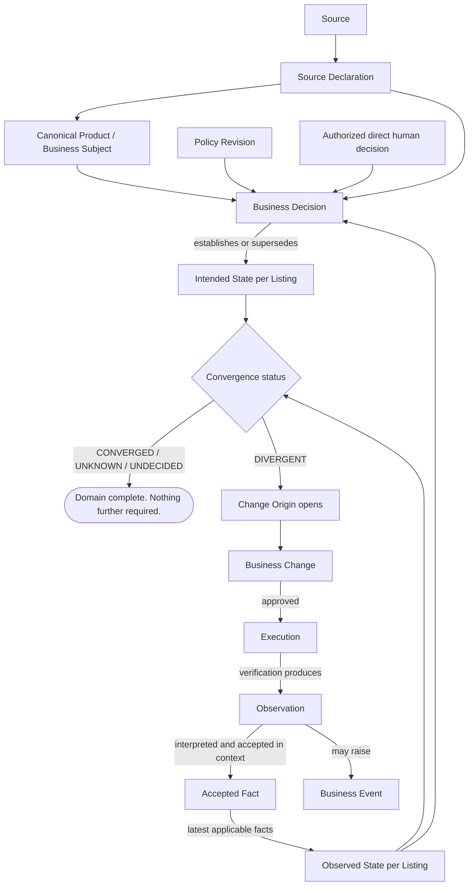

# FlowHub Canonical Platform Architecture — Canon v1

## Context

The Owner has ended evolution of the current implementation. The repository is
no longer the architecture; it is evidence only. Where implementation and
architecture conflict, the implementation is wrong.

This plan produces the **canonical platform architecture** — implementation-,
connector-, UI-, and technology-independent — as the single authority every
future implementation must follow. **No code changes. No refactoring. No
repository documentation.** The output is a new canon.

---

## Correction: the previous conceptual center was wrong

The first draft of this plan organized the platform around the Business Change
lifecycle. That model fails the Owner's test and is discarded.

**Test — if no change occurred today, does FlowHub still have a complete
domain?** Yes. With zero Business Changes in existence, FlowHub still has
canonical products, listings on channels, prices, availability, what Sources
declare, what Channels report, active policies, what state *should* be, and
whether those agree. Nothing is missing.

Therefore Business Change cannot be the conceptual center. A concept whose
absence leaves the domain complete is a lifecycle *inside* the domain, not the
domain itself.

The error was mistaking the platform's most *visible* activity for its
*subject*. Change is what an operator notices; State is what the platform is.

**Corrected conceptual center: Commerce State.** FlowHub exists to **know**
Commerce State, **decide** what it should be, and **govern** any change to it.
Knowing and deciding are unconditional and always-on. Governing is conditional
and frequently empty.

Commerce State is **not** an Aggregate Root. It owns no identity, consistency
boundary, or lifecycle. It is an emergent domain view built from canonical
aggregates. **Listing** is the primary aggregate that owns Observed State,
Intended State, and Convergence. A Source Declaration is an upstream,
channel-independent declaration associated with a Canonical Product or other
Business Subject; it is not a Listing facet. Commerce State is therefore the
conceptual center of the domain; Listing remains its state-bearing Aggregate
Root.

### The five concepts, held apart

| Concept | What it is | Complete without the others? | Lifetime | Mutability |
| --- | --- | --- | --- | --- |
| **Commerce State** | The standing, knowable commercial condition of the catalog across channels. The conceptual center and an emergent view of state owned by canonical aggregates, primarily Listing. | **Complete without Change or Execution; never independent of its owning aggregates** | Perpetual | The view evolves as aggregate-owned State evolves; each value has exactly one immutable attribution basis |
| **Business Event** | A domain-meaningful occurrence, external or internal. Facts of *what happened*. | **Yes** — a Channel price moves with no decision and no change | Instant; recorded forever | Immutable |
| **Business Decision** | A judgment by an authorized Decision Producer — policy-driven or direct human — over State, yielding Intended State. | **Yes** — a Decision whose result equals observed state is complete and valid | Instant; superseded, never edited | Immutable record |
| **Business Change** | A governed, platform-initiated lifecycle for moving part of Commerce State toward its intended condition across an external boundary. It never represents a merely observed external occurrence. | **No** — requires divergence *and* a Change Origin | Bounded, terminal | State machine; terminal states final |
| **Execution** | The act of causing an external mutation, and proving it. | **No** — requires an approved Change Set | Bounded, terminal | Append-only attempts |

The distinctions that were previously collapsed and must not be again:

- **An Event is not a Change.** A competitor-driven price move observed on a
  Channel is an Event. It changes Observed State. FlowHub proposed nothing.
- **Not every observed business event is a Business Change.** An external
  WooCommerce price update is a Business Event. A FlowHub-approved price update
  is a Business Change because it is governed and platform-initiated.
- **A Decision is not a Change.** Policy evaluates continuously. A Decision that
  concludes "intended already equals observed" is a complete Decision with a
  real, recorded result — not a no-op and not a failed Change.
- **Divergence is not a Change.** Divergence is a *standing state property* of a
  Listing. It can persist indefinitely, unaddressed, and the domain stays valid.
  A Change is what a Change Origin *opens in response to* divergence.
- **Execution is not a Change.** A Business Change is the governed,
  platform-initiated lifecycle authorized to act; Execution is the act plus its
  proof. One Business Change may produce several Executions.

### Accepted Fact, Observation, State, and Decision

These are separate canonical concepts and must never be used as synonyms.

| Concept | Canonical definition | Evolution rule |
| --- | --- | --- |
| **Accepted Fact** | A time-scoped, authority-scoped fact accepted by FlowHub based on an immutable Observation and its pinned interpretation context. | Immutable historical fact |
| **Observation** | A time-scoped fact reported by a declared authority. An Observation may support an Accepted Fact; it is not automatically accepted. | Immutable once recorded |
| **State** | The platform's current interpretation. Factual State is projected from the latest applicable Accepted Facts; Intended State is attributed to the latest applicable Business Decision. | Evolves over time |
| **Decision** | A business judgment made over State by an authorized Decision Producer. | Each Decision record is immutable; the decision history evolves only through superseding records |
| **Evidence** | Immutable, non-decisional support for attribution, provenance, or proof. | Immutable once recorded |

Accepted Facts, Observations, and Evidence are immutable. State evolves.
Decisions evolve only by recording a new Decision that supersedes an earlier
one; an existing Decision is never edited. Of these concepts, only State changes
in place over time.

An Accepted Fact is never global or timeless. Its effective time, scope,
authority, Observation, and interpretation context determine applicability.
Conflicting-looking facts may both remain valid historical facts in their own
contexts. Current factual State is a projection over the latest applicable
Accepted Facts:

```text
Observation → Accepted Fact → Current State Projection
```

### The causal chain — one-directional, optional after Decision



Everything below the `DIVERGENT` branch may be permanently empty. The loop
closes through Event, not through Change: an Execution's verification produces
new Observations, which raise Events, which update Observed State, which
recomputes Convergence.

---

## The architecture being canonized

### Aggregate hierarchy, re-derived

Aggregate roots are chosen by **what must hold a consistency boundary**, not by
what appears in a workflow diagram.

| Aggregate root | Why it is a root | Owns |
| --- | --- | --- |
| **Ownership Scope** | Every uniqueness and isolation claim is only meaningful inside one | Scope identity; all uniqueness namespaces |
| **Canonical Product** | Identity must be settled independently of any channel | Canonical identity, Identity Authority, source-key bindings, channel-independent attributes |
| **Listing** (Product × Channel) | **The state-bearing root.** All per-channel commercial state is per-Listing; a degraded Channel must never contend with a healthy one | Observed State, Intended State, Convergence status — each with its attribution |
| **Source Declaration** | A Source declaration has its own scope, effective time, and lifecycle independently of any Listing | Declared subject, value, unit, scope, effective time, Source authority, and interpretation context |
| **Provider Instance** | Configuration and declared capability change on their own cadence | Provider identity, played roles, declared capabilities, connection configuration |
| **Policy Revision** | Immutable once issued; decisions must pin it | Rules, scope resolution, unit declarations, guards |
| **Observation Run** | Durable and terminal independent of what consumes it | Run lifecycle, Observations, evidence, drift findings |
| **Interpretation** | Acceptance of a reported fact must pin its own context and remain immutable independently of later State | Accepted Fact, referenced Observation, effective time, scope, authority, and interpretation context |
| **Business Change** | A bounded, governed, platform-initiated lifecycle with its own concurrency | Origin, proposal, change set, review, selection, approval |
| **Execution** | Long-running, per-channel, append-only; must not contend with Change review | Plan, dispatch intents, dispatches, receipts, verifications, outcome |

**Product is not the parent of Listing.** If it were, every channel observation
would contend on the Product aggregate, and one degraded Channel would block
every other. Listing references Product by identity and is its own root.

**Change does not own state.** It references Listings and carries intent about
them. Deleting every Business Change in the system loses governance history —
it loses no Commerce State.

### Canonical Ownership Model

Every canonical concept has exactly one owner. Ownership means responsibility
for identity, consistency, and lifecycle. Authority means the single role or
rule whose report or judgment may establish the concept's value; authority is
never shared. Evidence may describe ownership. Evidence never owns.

For Listing State facets, this distinction is essential: Listing owns the State,
while Channel or Decision Engine is its sole authority. A Source owns authority
for its Source Declarations, not for the State of every Listing. Thus State
remains inside the Listing consistency boundary without turning its reporting
authority into an Aggregate Root.

| Concept | Owner | Authority | Required authorization / evidence | Mutable? | Notes |
| --- | --- | --- | --- | --- | --- |
| **Ownership Scope** | Ownership Scope | Scope authority | — | Yes | Scope identity is stable; governed metadata may evolve |
| **Canonical Product** | Catalog | Identity Authority | — | Yes | Identity changes only through governed identity operations |
| **Listing** | Listing | Listing aggregate | — | Yes | Owns all per-channel commercial State |
| **Commerce State (per Listing)** | Listing | The authority of the relevant State facet | Immutable attribution basis for each value | Yes | Emergent view; has no independent identity or lifecycle |
| **Source Declaration** | Source Declaration | Source | — | No | Upstream, time- and scope-bound declaration associated with a Canonical Product or other Business Subject; never implicitly copied to Listings |
| **Observed State** | Listing | Channel | Accepted Fact + Observation | Yes | Current interpretation evolves; attribution records remain immutable |
| **Intended State** | Listing | Decision Engine | Immutable Business Decision | Yes | Current interpretation evolves; supporting Decisions remain immutable |
| **Convergence** | Listing | Declared comparison rule | Pinned comparison rule + freshness policy + input State revisions | Yes, derived | Recomputed from its attributed inputs |
| **Provider Instance** | Provider Registry | Provider authority | — | Yes | Capability and configuration changes occur through revisions |
| **Policy Revision** | Policy Governance | Authorized policy issuer | — | No | Immutable once issued |
| **Observation** | Observation Run | Reporting authority | — | No | Immutable, time-scoped fact as reported, whether or not accepted |
| **Accepted Fact** | Interpretation | Authority assigned to the fact | Observation + interpretation context | No | Time-, scope-, authority-, Observation-, and interpretation-context-bound historical fact |
| **Business Event** | Event Store | Event-producing authority | — | No | Immutable occurrence; may be external or internal |
| **Business Decision** | Decision Engine | Authorized Decision Producer | Pinned decision basis | No | Pins its policy or direct-human basis; superseded by a new record, never edited |
| **Business Change** | Change Governance | Authorized Change Governance | Approved Change Set | Yes | Only governed, platform-initiated change; terminal states are final |
| **Execution** | Execution Engine | Execution Governance | Approved Change Set + Execution Safety Preconditions | Append-only | Attempts, receipts, and verifications are appended |
| **Evidence** | Evidence Spine | None — non-authoritative | — | No | May be consumed to support, prove, downgrade, or invalidate; never grants or upgrades authority by itself |
| **Audit** | Audit | Canonical records | — | Append-only | A projection over canonical records, not an alternate authority |

### Commerce State and its facets

A Listing carries three facets. The first two are values; the third is derived.

| Facet | Current interpretation | Attributed to |
| --- | --- | --- |
| **Observed State** | What the platform currently interprets from facts a Channel reports | An Accepted Fact + its Observation |
| **Intended State** | What the platform currently interprets from a policy-driven or direct-human Business Decision about what should be true | A Business Decision |
| **Convergence** | Derived relation between Intended and Observed | A pinned comparison rule + freshness policy + input State revisions |

Source Declaration is not a Listing facet. It is an upstream input associated
with a Canonical Product or other Business Subject. Decision policy resolves its
scope and may produce different Intended State for different Listings:

```text
Source → Source Declaration → Canonical Product / Business Subject
       → Decision Policy → Intended State per Listing
```

Convergence values are first-class and never collapsed:

- `CONVERGED` — intended and observed agree under the declared comparison rule
- `DIVERGENT` — they differ
- `UNKNOWN` — observed state is absent or too stale to compare
- `UNDECIDED` — no applicable Business Decision has established Intended State
  (for example, required decision input is absent or unusable)

Price, availability/inventory, and status are **attributes of these facets on a
Listing** — not separate subsystems. The current implementation's five pricing
packages exist because pricing was modeled as a subsystem rather than as a state
attribute with a decision rule.

### Layers and dependency direction

Nothing in a lower layer may reference anything in a higher one.

| Layer | Concerns | Can the platform be complete with this layer empty? |
| --- | --- | --- |
| **0 — Foundation** | Ownership Scope, actors, authorization, Provider Contract, evidence spine | No — structural |
| **1 — Commerce State** | Catalog identity, Listing, state facets, convergence | No — **this is the domain** |
| **2 — Knowledge** | Acquisition and interpretation; Source Declarations; Observations → Accepted Facts → factual State | No — State would be unattributed |
| **3 — Judgment** | Policy-driven and direct-human Business Decisions → Intended State | No — Intended State would not exist |
| **4 — Governance of change** | Change lifecycle, Execution, Reconciliation | **Yes — routinely empty** |

Layer 4 being optional is the structural expression of the Owner's test.

Three rules that carry most of the remaining weight:

- **Ownership and authority are singular.** Every canonical concept has exactly
  one owner, and authority is never shared. Evidence may describe ownership;
  Evidence never owns.

- **Source and Channel are roles, not types.** One Provider Instance may play
  both. (WooCommerce plays both today and is forced through two unrelated
  ingestion stacks because of this error.)
- **Evidence is immutable and non-decisional.** Evidence may be consumed by
  decisions, guards, verification, reconciliation, diagnostics, and audit.
  Evidence never grants authority by itself. Authority comes from the canonical
  authority assigned to the fact, State facet, policy, actor, or Provider role.
  Evidence may support, prove, downgrade, or invalidate a claim. It may never
  independently upgrade authority.

### The constitution

Canon v1 is anchored by numbered, testable invariants. The center-level ones,
which the previous draft did not have:

- **Commerce State is the conceptual center, not an Aggregate Root.** It is an
  emergent domain view. Listing owns Observed State, Intended State, and
  Convergence. Source Declarations remain upstream and independent of Listings.
  The model is complete and valid when zero Business Changes and zero Executions
  exist.
- **Every canonical concept has exactly one owner. Authority is never shared.**
  Evidence may describe ownership; Evidence never owns.
- **Accepted Facts, Observations, and Evidence are immutable. State evolves.**
  Every Accepted Fact is time-scoped and authority-scoped and pins its
  Observation and interpretation context. Current factual State is a projection
  over the latest applicable Accepted Facts. Decisions evolve only through new
  immutable, superseding records. Of these concepts, only State changes in
  place over time.
- **Evidence is immutable and non-decisional, not unusable.** Decisions, guards,
  verification, reconciliation, diagnostics, and audit may consume Evidence.
  Evidence may support, prove, downgrade, or invalidate a claim, but never
  grants or independently upgrades authority.
- **Source Declaration is upstream of Listing State.** A Source Declaration is
  associated with a Canonical Product or other Business Subject and never
  implicitly establishes State for every Listing. Only a Business Decision may
  establish Intended State per Listing.
- **No canonical concept in Foundation, Commerce State, Knowledge, or Judgment
  may depend on Business Change or Execution.** Business Change, Execution, and
  Reconciliation belong exclusively to the optional Governance-of-Change layer
  and may depend on the lower layers, never the reverse.
- **Every State value must have exactly one immutable attribution basis.**
  Factual State must trace to an Accepted Fact and its Observation. Intended
  State must trace to an immutable Business Decision. Derived State such as
  Convergence must trace to its pinned comparison rule, freshness policy, and
  input State revisions. Unattributed State is forbidden.
- **An Event is complete without a Decision or a Change.**
- **A Decision is complete without a Change.** Intended == Observed is a valid,
  complete result.
- **Divergence is a standing state, not an occurrence.**
- **A direct human decision may establish or supersede Intended State.** It must
  produce an immutable Business Decision through the Decision model. Direct
  interaction never bypasses that model.
- **Change is subordinate and optional** — permitted only where Convergence is
  `DIVERGENT` and a Change Origin opened it. A Business Change may open only
  after a Business Decision has produced Intended State and Convergence has
  been evaluated as `DIVERGENT`. It represents only governed,
  platform-initiated change and never a merely observed external event. Change
  never owns state.
- **Execution is subordinate to Change** — none may exist without an approved
  Change Set.
- **`UNKNOWN` and `UNDECIDED` are explicit** and never collapsed into
  `CONVERGED` or `DIVERGENT`.

Carried forward, unchanged in force:

- Observations are immutable; a failed or blocked acquisition yields a terminal
  outcome and evidence, never a fabricated Observation.
- **Absence is not a value.** Missing, uninstructed, unusable, and invalid are
  distinct explicit states — never coerced to null, zero, or a default.
- Source Product Key, Identity Authority, Canonical Product ID, and Channel
  Product Identifier are four distinct concepts; none is inferable from another.
- Exactly one canonical Product identity per real product per Ownership Scope.
- All per-channel commercial state belongs to a Listing, never to a Product.
- **Money and stock are exact**, with an explicit declared unit at every
  boundary — provider and API included. Binary floating point is forbidden.
  Magnitude inference (Rial vs Toman) is forbidden.
- Decision arithmetic rounds exactly once, by a declared rule.
- No canonical path evaluates arbitrary expression text at runtime.
- A Decision over pinned inputs replays to an identical result and fingerprint.
- Every evaluation has a frozen evaluation time.
- A write is never a side effect of a read, edit, refresh, import, mapping save,
  or configuration change.
- A dispatch intent is durably committed before any external mutating call.
- **Capability ≠ authorization.** Both must hold; neither implies the other.
- Verification is mandatory; provider acceptance alone is never success.
- A degraded Channel never blocks a healthy Channel.
- Every canonical record belongs to exactly one Ownership Scope.
- No canonical concept may be defined in terms of a page, route, grid, or screen.

---

## What the evidence shows (why a canon is required)

Read from the repository as evidence, not as design:

| Evidence | What it proves |
| --- | --- |
| 42 backend packages, 156 tables across 16 prefixes, 46 migrations | Subsystems accreted per delivery phase, not per domain concept |
| Product identity in ≥5 stores (`uw_canonical_products`, `uw_listings`, `dl_product_cache`, `sc_source_product_identities`, `uw_channel_cache`) | No single canonical identity root |
| Listing state split between a workspace model and a channel "cache" | Commerce State has no single home; "cache" is state wearing a disguise |
| Two parallel external-write authorities (`flowhub_write_*`, `uw_apply_*`) plus `flowhub_provider_write_attempts` | Single write authority is documented but not structurally true |
| Source reads and Channel reads use unrelated stacks (`saq_*` + `source_acquisition` vs `dl_*` + `read_engine`) | Source/Channel modeled as types, not roles |
| Three channel registries (`ip_connector_instances`, `uw_channels`, `pm_channel_config_revisions`) | Provider identity is not canonical |
| Five pricing packages (`pm_`, `pev_`, `sv_`, `ft_`, `fmp_`) | Pricing modeled as a subsystem rather than a state attribute with a decision rule |
| Five observability stores (`ip_*`, `dl_connector_health`, `logging_*`, `bo_*`, diagnostics) each re-deriving accepted facts and current state | No evidence spine; health computed differently per surface |
| 28 `float` money declarations at provider/API boundaries; `currency: str = "EUR"` default in the write pipeline | Directly contradicts the documented exact-arithmetic and explicit-unit rules |
| Data Layer read paths defined as "Read Path 1: Products page", "Read Path 2: Workspace preview" | Architecture defined in terms of UI routes |
| Zero tenant/org/account scoping anywhere in `app/flowhub` | No ownership boundary exists in the model |
| Ten API routers exist as unmounted stubs; `CAPABILITY_REGISTRY.md` is "not implemented, not wired" | Documents and code disagree about what exists |

These are not bugs to fix. They are the symptom the canon exists to remove.

## Owner decisions governing this canon

1. **Center** — Commerce-native canon on a domain-neutral governed spine.
2. **Tenancy** — Tenancy-neutral core. Self-hosted single-org is the degenerate
   one-scope case; hosted multi-org is the same model with many. Neither assumed.
3. **Breadth (Canon v1)** — catalog identity; Product/Listing relationships;
   pricing; inventory/availability; Source Declarations; Channel observed state;
   observations and evidence; business change lifecycle; decision/approval;
   execution preparation; execution; verification; reconciliation; audit.
   **Outside Canon v1:** orders, fulfillment, payments, refunds, reporting, AI.
   Automation and scheduling appear **only** as future Change Origins / Decision
   Producers and do not expand the v1 business domain.
4. **Authority** — the canon is the single architectural authority. Every
   existing ADR, architecture document, design spec, and contract becomes
   evidence only. Conflicts resolve to the canon. An explicit superseded index
   must make this impossible to mistake.
5. **Center and ownership** — Commerce State, not Business Change, is the
   conceptual center. Commerce State is not an Aggregate Root; it is an emergent
   domain view whose State facets are owned by Listing. Business Change is one
   governed, platform-initiated lifecycle inside the Commerce Domain.

---

## Deliverable

A new `docs/canonical/` directory — the single architectural authority. Nothing
else in the repository is created, modified, or deleted.

| # | Document | Covers |
| --- | --- | --- |
| 00 | `00-CANON-CHARTER.md` | Purpose; Commerce State as conceptual center but not an Aggregate Root; the completeness test; v1 boundary and exclusions; authority and supersession rule |
| 01 | `01-CONCEPT-SEPARATION.md` | Accepted Fact / Observation / State / Decision / Evidence and Commerce State / Business Event / Business Decision / Business Change / Execution — definitions, differences, dependency direction |
| 02 | `02-COMMERCE-STATE-MODEL.md` | The standing model; Source Declarations upstream; Observed / Intended Listing facets; Convergence including `UNKNOWN` and `UNDECIDED` |
| 03 | `03-AGGREGATE-MAP.md` | Aggregate roots, consistency boundaries, the Canonical Ownership Matrix, authority, Ownership Scope, concurrency |
| 04 | `04-CATALOG-IDENTITY-MODEL.md` | Canonical Product; Identity Authority; source keys; channel identifiers; bindings |
| 05 | `05-LISTING-MODEL.md` | The state-bearing aggregate; price, availability/inventory, status as state attributes |
| 06 | `06-EVIDENCE-AND-ATTRIBUTION.md` | Accepted Facts; immutable non-decisional Evidence; authority separation; Business Events; the audit spine; audit/diagnostics/health as projections |
| 07 | `07-PROVIDER-CONTRACT.md` | Provider identity; roles (Source / Channel / both); declared capabilities; operations; error taxonomy |
| 08 | `08-ACQUISITION-AND-INTERPRETATION.md` | Runs → Observations → Accepted Facts; Source Declarations; mapping revisions; normalization; unit declaration; instruction semantics; data quality; drift |
| 09 | `09-DECISION-MODEL.md` | Policy revisions; direct-human decisions; scope resolution; exact arithmetic; guards; determinism; Decision Producers → Intended State |
| 10 | `10-CHANGE-LIFECYCLE.md` | Change Origins; proposal; change set; review; selection; approval — as a subordinate, optional lifecycle |
| 11 | `11-EXECUTION-AND-VERIFICATION.md` | Execution preparation; dispatch intent; dispatch; receipt; verification; outcomes |
| 12 | `12-RECONCILIATION-MODEL.md` | Post-execution convergence determination; explicit unknown state; feedback into Commerce State |
| 13 | `13-GOVERNANCE-MODEL.md` | Ownership Scope; actors; capability vs authorization; safety gates; Change Origins and Decision Producers as extension points |
| 14 | `14-INTERFACE-MODEL.md` | Projections and Commands; UI-, CLI-, and client-independence |
| 15 | `15-CANONICAL-INVARIANTS.md` | The numbered constitution |
| 16 | `16-CONFORMANCE.md` | How any implementation is judged against the canon |
| 17 | `17-EVIDENCE-MAP.md` | Where the repository confirms or contradicts each invariant |
| 18 | `18-SUPERSEDED-INDEX.md` | Every pre-canon document reclassified as evidence only |

Every Owner-listed v1 topic maps to a document above. Orders, fulfillment,
payments, refunds, reporting, and AI are named in `00` as deliberately
un-canonized — so no future reader treats the existing order subsystem as
canonical either.

### Document conventions

- Each canonical term is **defined exactly once**, in exactly one document.
- Each invariant states: the rule, a concrete violation, and how conformance is
  tested.
- Documents 00–09 must be readable and complete **without** documents 10–12.
  This is the structural enforcement of Change's subordinate position.
- Diagrams are Mermaid and domain-level only.
- No document names a framework, language, database, library, provider, table,
  or route — **except** `17-EVIDENCE-MAP.md`, the only place the repository may
  be cited.

---

## Execution phases

Each phase ends at an Owner review gate. Implementation remains forbidden until
the canon is ratified.

**Phase A — Center and ownership.** `00`, `01`, `02`, `03`.
What the platform is, the canonical concepts held apart, the standing state
model, the aggregate hierarchy, and the ownership matrix. If the conceptual
center or ownership is wrong, everything downstream is wrong again — as the
discarded draft demonstrated. This gate matters most.

**Phase B — Commerce State in full.** `04`, `05`, `06`, `07`, `08`, `09`.
Identity, listing state, attribution, providers, how state becomes known, and
how intended state is decided. **At the end of Phase B the canon must already
describe a complete, meaningful platform** without depending on Change or
Execution. That is the acceptance test for Phase B.

**Phase C — Governed change.** `10`, `11`, `12`, `13`, `14`.
The optional lifecycle layer, governance, and the interface model.

**Phase D — Authority and evidence.** `15`, `16`, `17`, `18`.
Constitution, conformance definition, repository-as-evidence map, superseded
index covering every existing `.md` under `docs/` and the repository root.

**Ratification gate.** The Owner accepts the canon. Only then may any
implementation plan be written, and only as adaptation *to* the canon.

---

## Sources of domain semantics to mine (evidence only)

These contain hard-won domain semantics worth canonizing — read for **meaning**,
never for structure:

- [ADR_SOURCE_PRODUCT_IDENTITY_AUTHORITY_ADDENDUM.md](docs/evidence/architecture/ADR_SOURCE_PRODUCT_IDENTITY_AUTHORITY_ADDENDUM.md) — the Source Product Key / Identity Authority / Channel Product Identifier separation is already correct and becomes canonical.
- [unified_workspace/domain.py](app/flowhub/unified_workspace/domain.py) — `SourceInstruction` (SET / NO_INSTRUCTION / UNAVAILABLE / UNUSABLE / INVALID) is the best expression of "absence is not a value" in the repository; `ApplyItemOutcome` is the best execution lifecycle.
- [PRICING_MATRIX_DESIGN.md](docs/evidence/architecture/PRICING_MATRIX_DESIGN.md) — exact arithmetic, one rounding, explicit units, scope resolution, outcome precedence, the declarative-only prohibition.
- [SOURCE_ACQUISITION_DESIGN.md](docs/evidence/architecture/SOURCE_ACQUISITION_DESIGN.md) — run/observation/evidence separation, stable reason codes, fail-closed security.
- [channels/contracts.py](app/flowhub/channels/contracts.py) — the error category + retry metadata taxonomy generalizes well.
- [read_engine/contracts.py](app/flowhub/read_engine/contracts.py) — capability declaration shape, once its provider assumptions are stripped.
- [ADR_DIAGNOSTICS_STATE_MODEL.md](docs/evidence/architecture/ADR_DIAGNOSTICS_STATE_MODEL.md), [CAPABILITY_REGISTRY.md](docs/evidence/architecture/CAPABILITY_REGISTRY.md) — capability-vs-authorization separation, and the governance rule that evidence may downgrade but never upgrade a claim.

---

## Verification

The canon is a specification, so verification is structural and mechanical.
Each check gates Phase D completion.

1. **Completeness and ownership test.** Documents 00–09 are read in isolation.
   They must describe a complete, coherent platform without depending on Change
   or Execution. A lower-layer concept may describe the separation but may not
   require either lifecycle. Business Change, Execution, and Reconciliation may
   depend on the lower layers, never the reverse. Commerce State must never be
   modeled as an Aggregate Root, and every canonical concept must resolve to
   exactly one owner in the Canonical Ownership Matrix.
2. **Concept-separation test.** For each of the five concepts, the canon states
   at least one scenario in which it exists while the others do not. Accepted
   Fact, Observation, State, Decision, and Evidence are also defined
   independently; only State may change in place. The test must also prove that
   Evidence can be consumed without granting authority, Source Declaration does
   not establish Listing State, and a direct human decision produces Intended
   State before a `DIVERGENT` Business Change may open. It must also verify that
   factual, intended, and derived State use their correct immutable attribution
   bases and that authorization artifacts never occupy the Authority column.
3. **Coverage.** Every Owner-listed v1 topic resolves to a named section,
   checked against the deliverable table.
4. **Independence audit.** Grep the canon, excluding `17-EVIDENCE-MAP.md`, for
   technology, connector, and UI vocabulary — `FastAPI`, `React`, `Postgres`,
   `SQLAlchemy`, `Alembic`, `Handsontable`, `httpx`, `WooCommerce`, `SnappShop`,
   `TapsiShop`, `Technolife`, `Digikala`, `Nextcloud`, table prefixes (`uw_`,
   `dl_`, `pm_`, `sc_`, `saq_`, `ip_`), and route paths (`/api/`, `/products`,
   `/workspace`). **Zero hits required.** This is the direct test of the Owner's
   four independence requirements.
5. **Term closure.** Every capitalized canonical term is defined exactly once,
   in one document, before any use.
6. **Invariant completeness.** Every invariant in `15` carries a rule, a
   violation example, and a conformance test description. No invariant is
   referenced elsewhere without existing in `15`.
7. **Internal consistency.** No canon document contradicts another. Each
   document's dependencies point only downward per `03`.
8. **Supersession completeness.** Every `.md` under `docs/` and the repository
   root appears in `18-SUPERSEDED-INDEX.md` exactly once, with an explicit
   no-authority statement. A file present in the tree but absent from the index
   is a failure.
9. **Evidence-map traceability.** Every invariant in `15` has a row in `17`
   marked confirmed, contradicted, or absent, citing a concrete repository
   location. Each of the twelve contradictions above must appear.
10. **Non-mutation.** `git status` shows only additions under `docs/canonical/`.
    No existing file modified, moved, or deleted.

---

## Explicitly out of scope

- Any code change, refactor, migration, or schema work.
- Any repository documentation update outside `docs/canonical/`.
- Any implementation plan — that follows ratification, as a separate exercise.
- Orders, fulfillment, payments, refunds, reporting, AI (Owner decision).
- Deleting or editing superseded documents; they are reclassified in place by
  the index, not removed.
